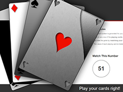

# Play your cards right"!"

## Purpose

A random number is generated for you at the start of every game.

Click on any one of the playing cards to reveal its hidden number, this number will then be revealed, and added to your total score.

You win the game by matching your total score to the random number, you lose the game if your total score goes above the random number.

The value of each playing card is hidden from you until you click on it.

* [Play](https://susanrbryant.github.io/Card-Game/)

**Code Style**
-JSdoc style commenting.

**Built With**
-HTML, CSS3, Bootstrap.
-jQuery.
-JavaScript.

**Future Plans**
-Improve landing page.

**Author**
-Susan Bryant

**Acknowledgments**
-Inspiration My Grandmother, who loved playing cards.

**License**
-This project is licensed under the MIT License.